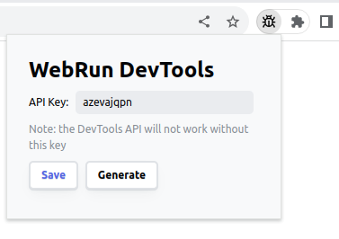

# WebRun DevTools
**Pilot Browser from the Browser**

WebRun DevTools is a Chrome browser extension that empowers developers to seamlessly write browser automation and testing scripts directly within HTML pages or notebooks, like [ObservableHQ](https://observablehq.com/). 

The API library interacts with the extension and provides access to the same features as standalone tools like Playwright or Selenium without the overhead of heavyweight external installations in NodeJS environment.

The API access is safeguarded by a key generated by the extension and never leaves your environment.

## TLDR

1. Install Extension:
  - Zipped File: [webrun-devtools-extension.zip](https://unpkg.com/@statewalker/webrun-devtools/dist/webrun-devtools-extension.zip)
  - [Chrome Web Store > WebRun DevTools](https://chromewebstore.google.com/detail/webrun-devtools/cfphcdekgckldjfmjajcklchnajkpakf)

3. Generate API Key:



3. Write automation code:
```js
import initDevTools from `https://unpkg.com/@statewalker/webrun-devtools`;
const api = await initDevTools({ apiKey: `your_generated_api_key` });
const win = await api.windows.create({ ... });
const imgUrl = await api.tabs.captureVisibleTab(win.id, ...);
...
await api.windows.remove(win.id);
await api.close();
```
You can check how it works using these Observabe Notebooks: [Observable > WebRun DevTools](https://observablehq.com/@kotelnikov/webrun-devtools)

The video below shows how to install and use a local extension:

[Video: WebRun DevTools - Introduction](https://github.com/statewalker/webrun-devtools/assets/1032407/22529b0f-6198-4970-9943-749209751665)

## Table Of Content

* [Examples](#examples)
* [How To Use](#how-to-use)
  * [Step 1: Install Extension](#step-1-install-extension)
  * [Step 2: Generate API Key](#step-2-generate-api-key)
  * [Step 3: Write Automation Scripts](#step-3-write-automation-scripts)
* [Build From Sources](#build-from-sources)
* [Exposed APIs](#exposed-apis)

## Examples

*Note 1: These examples will work only if you have the WebRun DevTools extension already installed and activated in your browser*

*Note 2: You can check working examples here: [Observable > WebRun DevTools](https://observablehq.com/@kotelnikov/webrun-devtools)*

* [Example 1: Create Screenshot](./examples/01.screenshot.html) ([cdn: Example 1](https://unpkg.com/@statewalker/webrun-devtools/examples/01.screenshot.html))
* [Example 2: Create Multiple Screenshots](./examples/02.screenshots-many.html) ([cdn: Example 2](https://unpkg.com/@statewalker/webrun-devtools/examples/02.screenshots-many.html)) 
* [Example 3: Multiple Screenshots with Chrome Debugger API](./examples/03.screenshots-debugger.html) ([cdn: Example 3](https://unpkg.com/@statewalker/webrun-devtools/examples/03.screenshots-debugger.html)) 

See also the "[Step 3: Write Automation Scripts](#step-3-write-automation-scripts)" section.

## How To Use

By following steps described below, you can seamlessly integrate the WebRun DevTools library into your HTML or notebook environment, establish a connection with the extension using the generated API key, and access various automation functionalities tailored to the specified access level.

1. [Install WebRun DevTools Extension](#step-1-install-extension): Add the extension to your Chrome browser.
2. [Generate API Key](#step-2-generate-api-key): Get an API key generated by the extension to access internal browser APIs. This key stays within your browser.
3. [Write Automation Scripts](#step-3-write-automation-scripts): Initialize the provided API with the generated key and write automation scripts in your HTML pages or ObservableHQ notebooks.

### Step 1: Install Extension

To install a Chrome extension from a local folder, follow these short instructions:

1. *Download the Extension:* Download the prepared extension from CDN (UNPKG: [webrun-devtools-extension.zip](https://unpkg.com/@statewalker/webrun-devtools/dist/webrun-devtools-extension.zip)) and unzip it in a separate folder. 

*Note: See how to build the extension from sources in the section [Build From Sources]( #build-from-sources )*

2. *Access Chrome Extensions:* Open the Google Chrome browser and go to the Extensions page. You can do this by typing `chrome://extensions/` in the address bar and pressing `Enter`.

3. *Enable Developer Mode:* In the top right corner of the Extensions page, toggle on the `Developer mode` switch.

4. *Load Unpacked:* After enabling Developer mode, a few additional options will appear. Click on the `Load unpacked` button.

5. *Select Extension Folder:* A file dialog will open. Navigate to the folder where you downloaded the extension files, select the folder, and click `Select Folder` (or equivalent).

6. *Verify Installation:* The extension should now appear in the list of installed extensions. Ensure that it is enabled by toggling the switch next to its name.

Now the Chrome extension should be successfully installed from the local folder, and you can use it within your browser.

### Step 2: Generate API Key

Once the extension is enabled, you can pin its icon to the Chrome toolbar for quick access: right-click on the extension icon within the Extensions page, and select `Show in toolbar` or a similar option. This will place the extension icon in your browser's toolbar for easy access. Now, the pinned extension icon on the toolbar gives access to the key generation UI. 

Click on the icon to reveal a popup panel managing the key for internal API access:


### Step 3: Write Automation Scripts

1. *Import the WebRun DevTools Library:* 

```js
import initDevTools from `path/to/webrun-devtools.js`;
OR:
import initDevTools from `https://unpkg.com/@statewalker/webrun-devtools`;
```

2. *Initialize the API:*
Make the initial call to the imported function, passing the generated API key as an argument. This call establishes the connection with the WebRun DevTools extension, validate the API key and returns an API object.
```js
const apiKey = `azevajqpn`; // your_generated_api_key
const api = await initDevTools({ apiKey });
```
*Note:* This operation will rise an exception if the extension is not installed in your browser or your API key is invalid.

3. *Access Functionality via API Object:*
The returned API object gives access to browser APIs and allows to perform various automation tasks.

*Note:* See the section "[Exposed APIs](#exposed-apis)" for more information

```js
// Example: Open a new window
const win = await api.windows.create({
    url : `http://example.com`,
    focused : true,
    width : 800,
    height : 600
  });

// Example: Capture a screenshot
const imgUrl = await api.tabs.captureVisibleTab(win.id, {
  format: `png`
});
```

The following example allows to create a screenshot of any website.
You can find the full code of this example here: [./examples/01.screenshot.html](./examples/01.screenshot.html) ([On-line version](https://unpkg.com/browse/@statewalker/webrun-devtools/examples/01.screenshot.html))

```html
<script type=`module`>
import initDevTools from `https://unpkg.com/@statewalker/webrun-devtools`;
// OR: 
// import initDevTools from `path/to/webrun-devtools.js`;

createScreenshot({
  // API key generated by the extension
  apiKey: `your_generated_api_key`,
  // URL of the site
  url: `https://www.google.com`,
  // Container element, where the screenshot should be attached. In this case it is the document body
  container: document.querySelector(`body`)
}).catch(console.error);

async function createScreenshot({
  apiKey,
  url,
  container
}) {
  const api = await initDevTools({ apiKey });
  try {
    // Open site in a new window
    const winOptions = { url, focused:true, width:800, height:600 }
    const win = await api.windows.create(winOptions);

    // Await a little bit while site is loading...
    await new Promise(resolve => setTimeout(resolve, 300));

    // Capture a PNG screenshot of the active tab
    const imgUrl = await api.tabs.captureVisibleTab(win.id, {
      format: `png`
    });

    // Create an image
    const div = document.createElement('div');
    container.appendChild(div);
    div.innerHTML = `<a href=`${url}` target=`_blank`>
      
    </a>`

    // Remove the window
    await api.windows.remove(win.id);

  } finally {
    // Cleanup resources and disconnect from the extension
    await api.close();
  }
}
</script>
```

## Build From Sources

```shell
> git clone https://github.com/statewalker/webrun-devtools.git
> cd webrun-devtools
> yarn 
> yarn build
```

Output:
* `/dist/webrun-devtools-extension` - ready to use Chrome extension (see the "[Step 1: Install Extension](#step-1-install-extension)" section)
* `/dist/webrun-devtools.js` - client-side script to import in your HTML pages

## Exposed APIs

This extension creates a bridge with the client code and the exposes the following subset of the [Chrome Extensions APIs](https://developer.chrome.com/docs/extensions/reference/):
* [chrome.windows](https://developer.chrome.com/docs/extensions/reference/windows/)
  - `create`
  - `get`
  - `getAll`
  - `getCurrent`
  - `getLastFocused`
  - `remove`
  - `update`
  - `onBoundsChanged`,
  - `onCreated`,
  - `onFocusChanged`,
  - `onRemoved`,
* [chrome.tabs](https://developer.chrome.com/docs/extensions/reference/tabs/):
  - `captureVisibleTab`
  - `connect` - not exposed; we can not return ports
  - `create`
  - `detectLanguage`
  - `discard`
  - `duplicate`
  - `executeScript` - deprecated; not available
  - `get`
  - `getAllInWindow` - deprecated; not available
  - `getCurrent`
  - `getSelected` - deprecated; not available
  - `getZoom`
  - `getZoomSettings`
  - `goBack`
  - `goForward`
  - `group`
  - `highlight`
  - `insertCSS` - deprecated; not available
  - `move`
  - `query`
  - `reload`
  - `remove`
  - `removeCSS` - deprecated; not available
  - `sendMessage`
  - `sendRequest` - deprecated; not available
  - `setZoom`
  - `setZoomSettings`
  - `ungroup`
  - `update`
  - `onActiveChanged` - deprecated; not available
  - `onActivated`
  - `onAttached`
  - `onCreated`
  - `onDetached`
  - `onHighlightChanged` - deprecated; not available
  - `onHighlighted`
  - `onMoved`
  - `onRemoved`
  - `onReplaced`
  - `onSelectionChanged` - deprecated; not available
  - `onUpdated`
  - `onZoomChange`
* [chrome.debugger](https://developer.chrome.com/docs/extensions/reference/debugger/)
  - `attach`
  - `detach` 
  - `sendCommand`
  - `getTargets`
  - `onDetach`
  - `onEvent`
  - `$once(target, event)` - this additional method allows to await the specified event generated by the debugger
* `custom` - a namespace to custom functions
  - `injectScript(target, { func, args = [], type = "module" })` - injects scripts in the current target tab
    - target - id of the target tab
    - func - code of the async function to inject in the page
    - args - list of arguments transferred in the function
